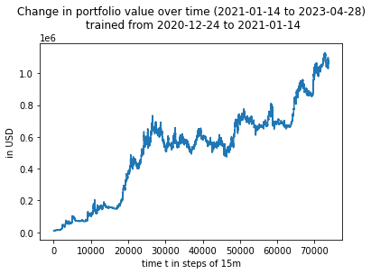
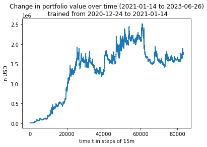

# Plots

Initial testing analyzed the growth of portfolios based on hyperparameters such as 
the weekly increments and the duration of tradestops. Tensorflow has two random seeds 
that contribute to somewhat different results: the global random seed and a random seed 
inside a neural network. During some experiments, only the global random seed was set.  

Generally speaking, using a tradestop duration of 2 days and online retraining intervals of 
3 weeks proved to result into the best growth. An online retraining duration of 1 week 
lead to good results as well, although it retrains too frequently during bull markets, 
it was somewhat better during a bear market period. On the other hand, a similar performance 
can be achieved with 3 weeks as the online retraining period as well.

The most promising network seems to be one obtained by random:

Keep in mind that trading fees were ignored here. On the other, these fees could potentially 
be offset with staking and savings rewards.